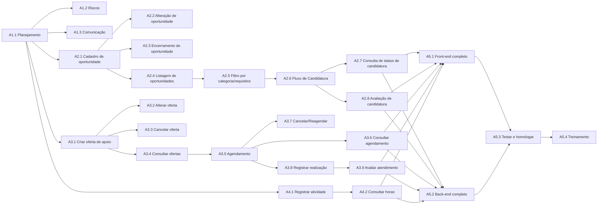

# Rede, Prazo e Orçamento - HubBCC

## 1. Gerenciamento do Cronograma

### 1.1 Como o prazo será gerido

- **Unidade:** Dia;
- **Calendário:** Sem recesso e semana de prova;
- **Limite de variação:** Atraso máximo de 1 semana;
- **Relatório de status:** Semanal, às terças;
- **Primeiro incremento:** Nove semanas.

### 1.2 Como o dinheiro será gerido

- **Moeda:** Real (R$);
- **Precisão:** Milhar;
- **Conta de custo:** Consolidada por pacote da EAP;
- **Custo do projeto:** Equipe, licenças e treinamento;
- **Aprovação de estouro:** Estouro de até 10% é absorvido pela contingência. Acima disso, o patrocinador aprova o uso da reserva de gestão;
- **Relatório:** Junto ao status semanal do cronograma.

## 2. Definição das Atividades

Cada pacote de trabalho da EAP (nível mais baixo, com sufixo `.1`, `.2` etc.) foi decomposto em uma ou mais atividades programáveis. As atividades funcionais (módulos 2, 3 e 4) são entregues em duas partes: primeiro a versão front-end, até o Marco 1, depois a integração com o back-end, até o Marco 2.

| Pacote EAP | Atividade | Descrição |
|------------|-----------|-----------|
| 1.1 | A1.1 | Planejar e monitorar cronograma, escopo e custo semanalmente |
| 1.2 | A1.2 | Identificar, registrar e revisar riscos a cada incremento |
| 1.3 | A1.3 | Preparar atas e comunicados às partes interessadas |
| 2.1.1 | A2.1 | Especificar e implementar cadastro de oportunidade |
| 2.1.2 | A2.2 | Especificar e implementar alteração de oportunidade |
| 2.1.3 | A2.3 | Especificar e implementar encerramento de oportunidade |
| 2.2.1 | A2.4 | Implementar listagem de oportunidades ativas |
| 2.2.2 | A2.5 | Implementar filtro por categoria/requisitos |
| 2.3.1 | A2.6 | Implementar fluxo de candidatura |
| 2.3.2 | A2.7 | Implementar consulta de status da candidatura |
| 2.4.1 | A2.8 | Implementar avaliação de candidatura |
| 3.1.1 | A3.1 | Implementar criação de oferta de apoio |
| 3.1.2 | A3.2 | Implementar alteração de oferta |
| 3.1.3 | A3.3 | Implementar cancelamento de oferta |
| 3.1.4 | A3.4 | Implementar consulta/filtro de ofertas |
| 3.2.1 | A3.5 | Implementar agendamento de monitoria/tutoria |
| 3.2.2 | A3.6 | Implementar consulta de agendamentos |
| 3.2.3 | A3.7 | Implementar cancelamento/reagendamento |
| 3.3.1 | A3.8 | Implementar registro de realização do atendimento |
| 3.3.2 | A3.9 | Implementar avaliação do atendimento |
| 4.1.1 | A4.1 | Implementar registro de atividade complementar com comprovante |
| 4.2.1 | A4.2 | Implementar consulta de total de horas |
| 5.1.1 | A5.1 | Integrar e finalizar interface responsiva (front-end completo) |
| 5.2.1 | A5.2 | Desenvolver API, integrações e persistência (back-end) |
| 5.3.1 | A5.3 | Testar e homologar com usuários |
| 5.4.1 | A5.4 | Treinar secretaria e professores |

> **Marco 1** (fim da parte front-end + A5.1): Front-end completo e responsivo - 06/10/2026.

> **Marco 2** (fim da parte back-end + A5.2/A5.3/A5.4): Sistema completo, testado e documentado - 01/12/2026.

## 3. Determinar a Sequência (Rede de Atividades)

| Atividade | Predecessora(s) | Tipo |
|-----------|------------------|------|
| A1.1 | - | Início do projeto |
| A1.2 | A1.1 | Término-início |
| A1.3 | A1.1 | Término-início |
| A2.1 | A1.1 | Término-início |
| A2.2 | A2.1 | Término-início |
| A2.3 | A2.1 | Término-início |
| A2.4 | A2.1 | Término-início |
| A2.5 | A2.4 | Término-início |
| A2.6 | A2.5 | Término-início |
| A2.7 | A2.6 | Término-início |
| A2.8 | A2.6 | Término-início |
| A3.1 | A1.1 | Término-início |
| A3.2 | A3.1 | Término-início |
| A3.3 | A3.1 | Término-início |
| A3.4 | A3.1 | Término-início |
| A3.5 | A3.4 | Término-início |
| A3.6 | A3.5 | Término-início |
| A3.7 | A3.5 | Término-início |
| A3.8 | A3.5 | Término-início |
| A3.9 | A3.8 | Término-início |
| A4.1 | A1.1 | Término-início |
| A4.2 | A4.1 | Término-início |
| A5.1 | A2.7, A2.8, A3.6, A3.9, A4.2 (parte front-end) | Término-início |
| A5.2 | A2.7, A2.8, A3.6, A3.9, A4.2 (parte back-end) | Término-início |
| A5.3 | A5.1, A5.2 | Término-início |
| A5.4 | A5.3 | Término-início |

### 3.1 Diagrama da rede



## 4. Estimativa de Esforço e Duração

Cada atividade funcional tem sua duração total (estimada por opinião especializada, análoga ou três pontos, com Média PERT = (Otimista + 4×Mais Provável + Pessimista) / 6) dividida em duas partes: a parte front-end, entregue até o Marco 1, e a parte back-end, que completa a atividade até o Marco 2. Quando a duração total é ímpar, o dia extra fica no back-end, por ser a parte mais complexa (integração e persistência).

| Atividade | Otimista | Mais provável | Pessimista | Duração total (PERT ou única) | Front-end (até Marco 1) | Back-end (até Marco 2) | Técnica |
|-----------|----------|---------------|------------|----------------------------------|---------------------------|---------------------------|---------|
| A1.1 | - | - | - | 3 | 3 | - | Opinião especializada |
| A1.2 | - | - | - | 2 | 2 | - | Opinião especializada |
| A1.3 | - | - | - | 2 | 1 | 1 | Opinião especializada |
| A2.1 | 4 | 6 | 10 | 6 | 3 | 3 | Três pontos |
| A2.2 | - | - | - | 3 | 1 | 2 | Análoga (a A2.1) |
| A2.3 | - | - | - | 2 | 1 | 1 | Análoga |
| A2.4 | - | - | - | 3 | 1 | 2 | Opinião especializada |
| A2.5 | 3 | 5 | 9 | 5 | 2 | 3 | Três pontos |
| A2.6 | 4 | 6 | 11 | 7 | 3 | 4 | Três pontos |
| A2.7 | - | - | - | 3 | 1 | 2 | Análoga (a A2.6) |
| A2.8 | - | - | - | 4 | 2 | 2 | Opinião especializada |
| A3.1 | 4 | 7 | 12 | 7 | 3 | 4 | Três pontos |
| A3.2 | - | - | - | 3 | 1 | 2 | Análoga |
| A3.3 | - | - | - | 2 | 1 | 1 | Análoga |
| A3.4 | 3 | 5 | 8 | 5 | 2 | 3 | Três pontos |
| A3.5 | 5 | 8 | 14 | 8 | 4 | 4 | Três pontos |
| A3.6 | - | - | - | 3 | 1 | 2 | Análoga |
| A3.7 | - | - | - | 3 | 1 | 2 | Opinião especializada |
| A3.8 | - | - | - | 2 | 1 | 1 | Opinião especializada |
| A3.9 | - | - | - | 3 | 1 | 2 | Opinião especializada |
| A4.1 | 4 | 6 | 10 | 6 | 3 | 3 | Três pontos |
| A4.2 | - | - | - | 3 | 1 | 2 | Opinião especializada |
| A5.1 | 8 | 12 | 20 | 13 | 13 | - | Três pontos |
| A5.2 | 10 | 15 | 24 | 16 | - | 16 | Três pontos |
| A5.3 | 6 | 10 | 16 | 10 | - | 10 | Três pontos |
| A5.4 | - | - | - | 4 | - | 4 | Opinião especializada |

## 5. Caminho Crítico e Folgas

### 5.1 Até o Marco 1 (Front-end)

Os módulos 2, 3 e 4 correm em paralelo após A1.1, usando somente a coluna "Front-end" de cada atividade, e convergem em A5.1.

| Ramo | Sequência | Duração acumulada |
|------|-----------|---------------------|
| Módulo 2 (Oportunidades) | A2.1 → A2.5 → A2.6 → A2.7 (e A2.8 em paralelo) | 3+2+3+1 = 9 dias |
| Módulo 3 (Apoio Acadêmico) | A3.1 → A3.4 → A3.5 → A3.8 → A3.9 | 3+2+4+1+1 = 11 dias |
| Módulo 4 (Atividades Complementares) | A4.1 → A4.2 | 3+1 = 4 dias |

O módulo 3 é o mais longo dos três ramos, portanto define a data de convergência para A5.1.

**Caminho crítico até o Marco 1:**

```
A1.1 → A3.1 → A3.4 → A3.5 → A3.8 → A3.9 → A5.1
  3   +  3   +  2   +  4   +  1   +  1   + 13   = 27 dias
```

Nota: A1.1 é atividade de gestão e roda em paralelo ao início dos módulos, mas por ser pré-requisito formal de todos eles, entra no caminho crítico com sua duração cheia (3 dias).

**Duração total até o Marco 1: 27 dias**, a partir de 07/09/2026, terminando por volta de 04/10/2026, 2 dias de folga em relação à meta de 06/10/2026 do Termo de Abertura.

| Ramo | Folga |
|------|--------------------------------------------------------|
| Módulo 2 (9 dias) | 11 − 9 = 2 dias de folga |
| Módulo 3 (11 dias) | 0 dias (é o próprio caminho crítico) |
| Módulo 4 (4 dias) | 11 − 4 = 7 dias de folga |

### 5.2 Até o Marco 2 (Sistema completo)

A partir do fim do Marco 1, os módulos completam a parte de back-end, usando a coluna "Back-end" de cada atividade, e convergem em A5.2, seguido de A5.3 e A5.4.

| Ramo | Sequência | Duração acumulada |
|------|-----------|---------------------|
| Módulo 2 (Oportunidades) | A2.1 → A2.5 → A2.6 → A2.7 (e A2.8 em paralelo) | 3+3+4+2 = 12 dias |
| Módulo 3 (Apoio Acadêmico) | A3.1 → A3.4 → A3.5 → A3.8 → A3.9 | 4+3+4+1+2 = 14 dias |
| Módulo 4 (Atividades Complementares) | A4.1 → A4.2 | 3+2 = 5 dias |

O módulo 3 volta a ser o mais longo, definindo a data de convergência para A5.2.

**Caminho crítico até o Marco 2 (contado a partir do fim do Marco 1):**

```
A3.1 → A3.4 → A3.5 → A3.8 → A3.9 → A5.2 → A5.3 → A5.4
  4   +  3   +  4   +  1   +  2   +  16  +  10  +  4   = 44 dias
```

**Duração total até o Marco 2: 44 dias** a partir do fim real do Marco 1 (04/10/2026), terminando por volta de **17/11/2026**, cerca de 14 dias de folga em relação à meta de 01/12/2026.

| Ramo | Folga (comparado ao módulo 3, que é o mais longo) |
|------|--------------------------------------------------------|
| Módulo 2 (12 dias) | 14 − 12 = 2 dias de folga |
| Módulo 3 (14 dias) | 0 dias (é o próprio caminho crítico) |
| Módulo 4 (5 dias) | 14 − 5 = 9 dias de folga |

## 6. Linha de Base do Cronograma

- **Data de referência de início:** 07/09/2026 (data de aprovação do Termo de Abertura).
- **Marco 1 - Front-end completo:** 27 dias de caminho crítico a partir de 07/09/2026, terminando por volta de **04/10/2026**, dentro da meta de 06/10/2026 do Termo de Abertura, com 2 dias de folga.
- **Marco 2 - Sistema completo:** 44 dias de caminho crítico a partir do fim do Marco 1, terminando por volta de **17/11/2026**, dentro da meta de 01/12/2026, com cerca de 14 dias de folga.

## 7. Estimativa de Custos

| Pacote EAP | Descrição | Custo estimado (R$) |
|------------|-----------|----------------------|
| 1. Gestão do Projeto | Planejamento, riscos e comunicação | R$ 2.500 |
| 2. Oportunidades Acadêmicas | Cadastro, consulta, candidatura, avaliação | R$ 6.000 |
| 3. Apoio Acadêmico | Ofertas, agendamento, realização, avaliação | R$ 7.500 |
| 4. Atividades Complementares | Registro e consulta de horas | R$ 2.500 |
| 5.1 Front-end | Interface responsiva | R$ 5.000 |
| 5.2 Back-end | API e integrações | R$ 6.500 |
| 5.3 Testes e homologação | Validação com usuários | R$ 3.000 |
| 5.4 Treinamento | Capacitação de secretaria e professores | R$ 1.000 |
| **Soma dos pacotes** | | **R$ 34.000** |

## 8. Desenvolver o Orçamento

| Componente | Valor |
|------------|-------|
| Soma dos pacotes | R$ 34.000 |
| Reserva de contingência (10%) | R$ 3.400 |
| **Linha de base do custo** (pacotes + contingência) | **R$ 37.400** |
| Reserva de gestão | R$ 3.000 |
| **Orçamento total autorizado** | **R$ 40.400** |

## 9. Aprovações

**Patrocinador:** Diogo Silveira Mendonça

**Data:** __ / __ / ____

**Gerentes do Projeto:**
- Erick Martins Silva
- Gabriel Centeio Freitas
- Guilherme Andrade Taveira
- Rafael Penela Grande Ferreira

**Data:** 21 / 09 / 2026