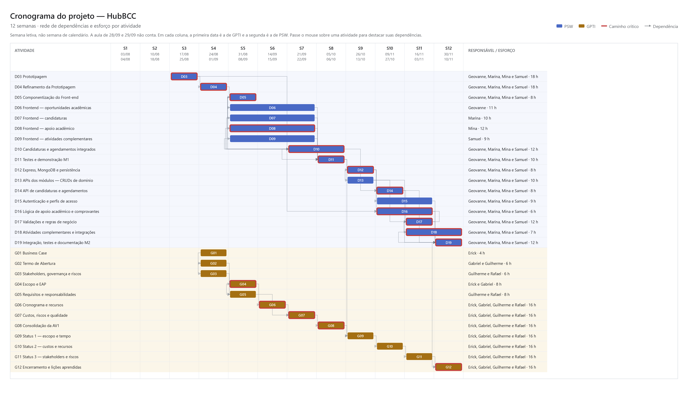
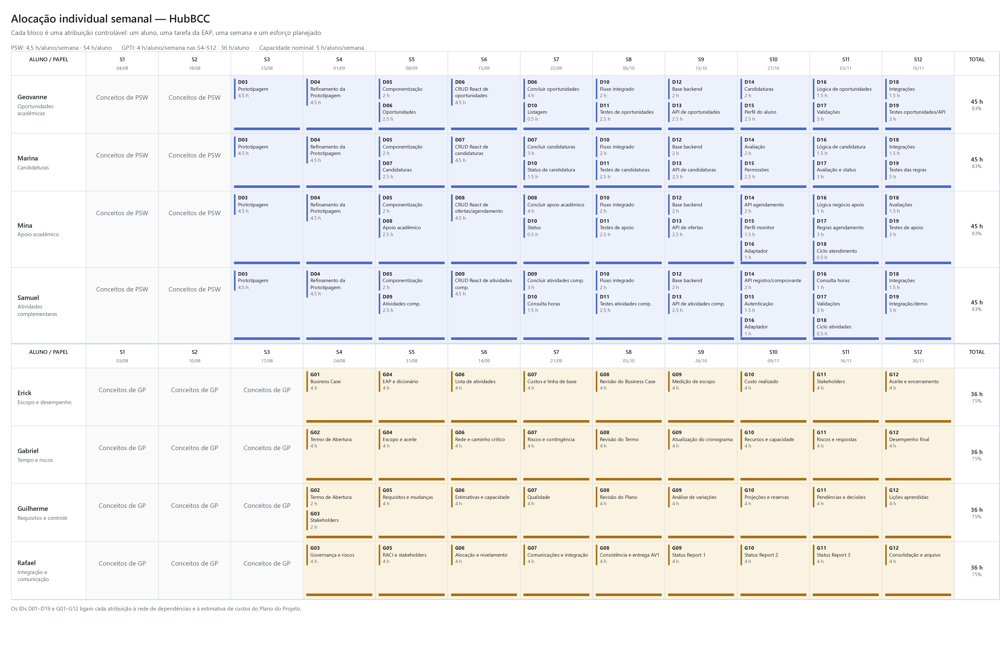
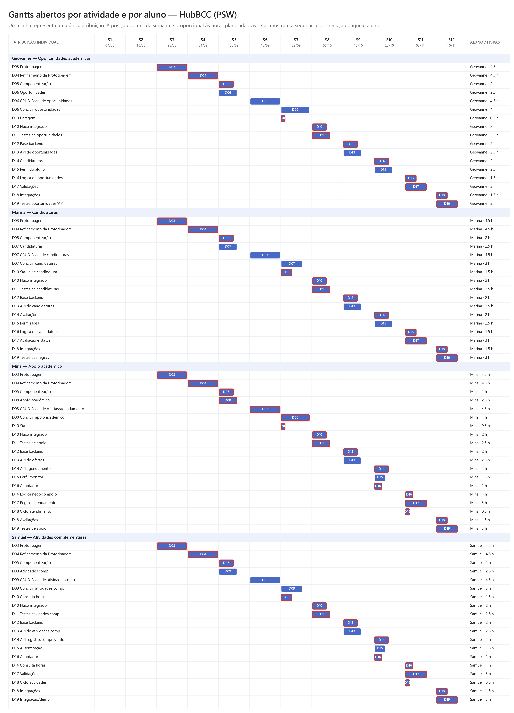
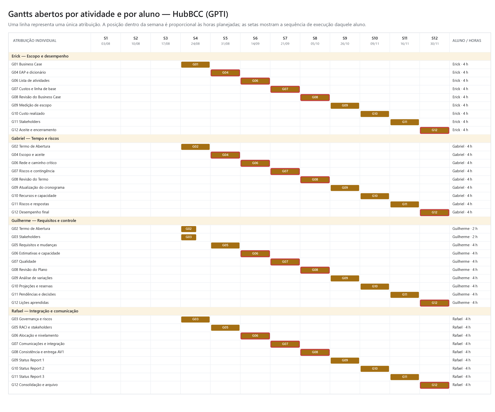

# Plano de Projeto — HubBCC

**Versão:** 1.0   
**Data:** 21/09/2026  
**Patrocinador:** Diogo Silveira Mendonça  
**Equipe:** 4 alunos de PSW (produto e desenvolvimento) e 4 alunos de GPTI (gestão e validação interna do escopo)

> Este documento contém a declaração do escopo, os requisitos, a matriz de rastreabilidade, a EAP, o cronograma, os recursos, os custos, os riscos e o engajamento. O dicionário da EAP está em [`GPTI-GrupoC-Dicionario_EAP.md`](GPTI-GrupoC-Dicionario_EAP.md).

**Números da linha de base**

| O quê | Valor | Onde |
|---|---:|---|
| Iniciação, ordem de grandeza | 520 h, R$ 9.800 (−25% a +75%) | Business Case |
| Capacidade dos calendários | 240 h PSW + 180 h GPTI = 420 h | 5.3 |
| Atividades niveladas | 216 h PSW + 144 h GPTI = 360 h, R$ 6.784,62 | 5.2, 6.2 |
| Contingência, por evento nomeado | 56 h = 24 h PSW + 32 h GPTI, R$ 1.055,38 | 6.3 |
| Linha de base de custos | 416 h, R$ 7.840,00 | 6.4 |
| Reserva gerencial, fora da linha de base | 7%, R$ 548,80 | 6.4 |
| Orçamento total simulado | R$ 8.388,80; desembolso R$ 0 | 6.4, termo 10 |
| Marcos | M1/AV1 na S8: GPTI 05/10 e PSW 06/10. M2 na S12: PSW 10/11; aceite GPTI 30/11 | 5.1 |

## 1. Objetivo da EAP

Decompor o trabalho e as entregas do HubBCC em componentes gerenciáveis. A EAP é orientada a entregas; a numeração representa relação hierárquica, não sequência de execução.

Os requisitos e regras são hipóteses definidas pelos alunos e validadas internamente; não equivalem a regras aprovadas pela instituição.

## 2. EAP / WBS

### 1.0 Projeto HubBCC

- **1.1 Gestão e coordenação do projeto**
  - 1.1.1 Termo e plano mantidos
  - 1.1.2 Backlog, decisões, riscos e mudanças
  - 1.1.3 Demonstrações e aceites internos
  - 1.1.4 Revisão técnica e pareamento
- **1.2 Requisitos e desenho funcional**
  - 1.2.1 Escopo funcional inicial
  - 1.2.2 Atores, permissões e fluxos
  - 1.2.3 Modelo de dados e contratos de API
  - 1.2.4 Dados acadêmicos necessários
  - 1.2.5 Hipóteses e limitações
  - 1.2.6 Protótipos de tela e navegação
- **1.3 Base técnica e ambientes**
  - 1.3.1 Aplicação React inicial
  - 1.3.2 API Express inicial
  - 1.3.3 MongoDB de desenvolvimento
  - 1.3.4 Dados fictícios de disciplinas e alunos
  - 1.3.5 Autenticação
  - 1.3.6 Perfil de administrador
- **1.4 Marco 1 — Frontend**
  - 1.4.1 Interface de oportunidades
  - 1.4.2 Interface de candidaturas
  - 1.4.3 Interface de apoio acadêmico
  - 1.4.4 Interface de atividades complementares
  - 1.4.5 Interface de disciplinas (administrador)
  - 1.4.6 Integração do M1
  - 1.4.7 Demonstração do M1
- **1.5 Backend e regras de negócio**
  - 1.5.1 API de oportunidades
  - 1.5.2 API de candidaturas
  - 1.5.3 API de apoio acadêmico
  - 1.5.4 API de agendamento
  - 1.5.5 API de atividades complementares
  - 1.5.6 API de disciplinas
  - 1.5.7 Cálculo de horas
  - 1.5.8 Autenticação e perfis
  - 1.5.9 Persistência
- **1.6 Marco 2 — Sistema integrado**
  - 1.6.1 Frontend na API Express
  - 1.6.2 Fluxos persistidos
  - 1.6.3 Regras demonstradas
  - 1.6.4 Tratamento de erros
  - 1.6.5 Demonstração final
- **1.7 Verificação e encerramento**
  - 1.7.1 Testes dos fluxos prioritários
  - 1.7.2 Testes das regras
  - 1.7.3 Defeitos tratados
  - 1.7.4 Instruções de execução
  - 1.7.5 Encerramento e lições
  - 1.7.6 Pendências institucionais

## 3. Regras de negócio

1. Oportunidades têm data de encerramento e autor identificado.
2. Candidatura não garante vaga; o status é visível ao aluno.
3. Ofertas de apoio podem ser gratuitas ou remuneradas; o valor é informativo, sem processamento de pagamento.
4. Agendamento só é confirmado se houver vaga.
5. Atendimento pode ser cancelado ou reagendado pelo aluno.
6. Após realização, monitor e aluno podem avaliar.
7. Atividades complementares exigem categoria, carga horária e comprovante.
8. Total de horas é calculado a partir das atividades registradas.
9. Perfis: aluno, monitor/tutor e administrador.
10. O administrador mantém o cadastro de disciplinas; aluno e monitor não acessam essa função.
11. Dados acadêmicos são fictícios.

## 4. Linha de base do escopo

A linha de base é a versão aprovada da declaração, da EAP e do dicionário. Só muda por controle de mudanças.

### 4.1 Declaração do escopo

Entregar, em 12 semanas, uma plataforma em que um aluno fictício consulta oportunidades, candidata-se, encontra apoio acadêmico, agenda atendimento, registra atividades complementares e consulta horas, e um administrador mantém o cadastro de disciplinas. A equipe GPTI entrega os artefatos de gestão. Integração institucional e sistema acadêmico real permanecem fora.

### 4.2 Necessidade e solução

| ID | Necessidade | Solução adotada |
|---|---|---|
| REQ-01 | Centralizar oportunidades acadêmicas | Módulo de oportunidades |
| REQ-02 | Permitir candidatura e acompanhamento | Módulo de candidaturas |
| REQ-03 | Ofertar monitorias e tutorias | Módulo de apoio acadêmico |
| REQ-04 | Agendar atendimentos | Módulo de agendamento |
| REQ-05 | Registrar atividades complementares | Módulo de horas |
| REQ-06 | Consultar total de horas | Cálculo e listagem |
| REQ-07 | Controlar perfis de acesso | Autenticação |
| REQ-08 | Demonstrar sem sistemas reais | Dados fictícios |
| REQ-09 | Manter cadastro de disciplinas | CRUD de disciplinas (administrador) |

### 4.3 Matriz de rastreabilidade

| ID | Pacotes | Aceite observável |
|---|---|---|
| REQ-01 | 1.4.1, 1.5.1 | Oportunidade criada, consultada e encerrada |
| REQ-02 | 1.4.2, 1.5.2 | Candidatura registrada e status visível |
| REQ-03 | 1.4.3, 1.5.3 | Oferta criada e filtrada |
| REQ-04 | 1.4.3, 1.5.4 | Agendamento confirmado |
| REQ-05 | 1.4.4, 1.5.5 | Atividade salva com comprovante |
| REQ-06 | 1.4.4, 1.5.7 | Total de horas exibido |
| REQ-07 | 1.3.5, 1.5.8 | Login sem provedor real e diferenciação por perfil |
| REQ-08 | 1.3.4 | Frontend funciona com dados fictícios |
| REQ-09 | 1.4.5, 1.5.6 | Administrador mantém disciplinas; aluno e monitor não acessam |

## 5. Processo de elaboração do cronograma

- **Unidade:** semana letiva; acompanhamento em horas-pessoa.
- **Horizonte:** 12 semanas letivas. M1/AV1 na S8. M2 na S12.
- **Calendários:** PSW 4,5 h/semana; GPTI 4 h/semana a partir da S4. Capacidade nominal: 5 h/semana.
- **Ferramentas:** EAP, lista de atividades, diagrama de precedências, quadro de tarefas e apontamento semanal.
- **Método:** estimativa bottom-up, com duas atividades conferidas por três pontos.
- **Regras de atualização:** progresso por esforço realizado e entrega aceita.
- **Limites de controle:** variação acima de 10% exige ação corretiva.

| Semana | GPTI | PSW |
|---:|---|---|
| 1 | 03/08 | 04/08 |
| 2 | 10/08 | 18/08 |
| 3 | 17/08 | 25/08 |
| 4 | 24/08 | 01/09 |
| 5 | 31/08 | 08/09 |
| 6 | 14/09 | 15/09 |
| 7 | 21/09 | 22/09 |
| 8 — M1 e AV1 | 05/10 | 06/10 |
| 9 | 26/10 | 13/10 |
| 10 | 09/11 | 27/10 |
| 11 | 16/11 | 03/11 |
| 12 — M2 | 30/11 | 10/11 |

### 5.1 Atividades de produto — PSW

| ID | Atividade | Predecessora | Janela | Esforço | Responsável |
|---|---|---|---:|---:|---|
| D03 | Prototipagem | — | S3 | 18 h | Geovanne, Marina, Mina e Samuel |
| D04 | Refinamento da Prototipagem | D03 | S4 | 18 h | Geovanne, Marina, Mina e Samuel |
| D05 | Componentização do Front-end | D04 | S5 | 8 h | Geovanne, Marina, Mina e Samuel |
| D06 | Frontend — oportunidades | D05 | S5–S7 | 11 h | Geovanne |
| D07 | Frontend — candidaturas | D05 | S5–S7 | 10 h | Marina |
| D08 | Frontend — apoio acadêmico | D05 | S5–S7 | 12 h | Mina |
| D09 | Frontend — atividades complementares | D05 | S5–S7 | 9 h | Samuel |
| D10 | Candidaturas e agendamentos integrados | D06–D09 | S7–S8 | 12 h | Geovanne, Marina, Mina e Samuel |
| D11 | Testes e demonstração M1 | D06–D10 | S8 | 10 h | Geovanne, Marina, Mina e Samuel |
| D12 | Express, MongoDB e persistência | D11 | S9 | 8 h | Geovanne, Marina, Mina e Samuel |
| D13 | APIs dos módulos — CRUDs | D12 | S9 | 10 h | Geovanne, Marina, Mina e Samuel |
| D14 | API de candidaturas e agendamentos | D10, D12 | S10 | 8 h | Geovanne, Marina, Mina e Samuel |
| D15 | Autenticação e perfis | D12 | S10–S11 | 9 h | Geovanne, Marina, Mina e Samuel |
| D16 | Lógica de apoio e comprovantes | D03, D12 | S10–S11 | 6 h | Geovanne, Marina, Mina e Samuel |
| D17 | Validações e regras de negócio | D13, D14, D16 | S11 | 12 h | Geovanne, Marina, Mina e Samuel |
| D18 | Atividades complementares e integrações | D17 | S11–S12 | 7 h | Geovanne, Marina, Mina e Samuel |
| D19 | Integração, testes e documentação M2 | D13–D18 | S12 | 12 h | Geovanne, Marina, Mina e Samuel |
| **Subtotal** |  |  |  | **180 h** |  |

### 5.2 Atividades de gestão — GPTI

| ID | Atividade | Predecessora | Janela | Esforço | Responsável |
|---|---|---|---:|---:|---|
| G01 | Business Case | — | S4 | 4 h | Erick |
| G02 | Termo de Abertura | G01 | S4 | 6 h | Gabriel e Guilherme |
| G03 | Stakeholders, governança e riscos | G02 | S4 | 6 h | Guilherme e Rafael |
| G04 | Escopo e EAP | G02 | S5 | 8 h | Erick e Gabriel |
| G05 | Requisitos e responsabilidades | G03, G04 | S5 | 8 h | Guilherme e Rafael |
| G06 | Cronograma e recursos | G04 | S6 | 16 h | Erick, Gabriel, Guilherme e Rafael |
| G07 | Custos, riscos e qualidade | G05, G06 | S7 | 16 h | Erick, Gabriel, Guilherme e Rafael |
| G08 | Consolidação da AV1 | G07 | S8 | 16 h | Erick, Gabriel, Guilherme e Rafael |
| G09 | Status 1 — escopo e tempo | G08, M1 | S9 | 16 h | Erick, Gabriel, Guilherme e Rafael |
| G10 | Status 2 — custos e recursos | G09 | S10 | 16 h | Erick, Gabriel, Guilherme e Rafael |
| G11 | Status 3 — stakeholders e riscos | G10 | S11 | 16 h | Erick, Gabriel, Guilherme e Rafael |
| G12 | Encerramento e lições aprendidas | G11, D19 | S12 | 16 h | Erick, Gabriel, Guilherme e Rafael |
| **Subtotal** |  |  |  | **144 h** |  |

### 5.3 Estimar recursos e durações

| Grupo | Pessoas | Calendário | Capacidade | Planejado | Utilização | Livre |
|---|---:|---|---:|---:|---:|---:|
| PSW | 4 | 5 h/semana, S1–S12 | 240 h | 180 h | 75% | 60 h |
| GPTI | 4 | 5 h/semana, S4–S12 | 180 h | 144 h | 80% | 36 h |
| **Total** | **8** |  | **420 h** | **324 h** | **77,1%** | **96 h** |

### 5.4 Desenvolver o cronograma e analisar o caminho crítico

- **Início:** semana 1, em 03/08; **término:** aceite do M2 em 30/11.
- **M1/AV1:** semana 8, GPTI em 05/10 e PSW em 06/10. **M2:** semana 12, PSW em 10/11 e aceite de GPTI em 30/11.
- **Caminho crítico técnico:** D03 → D04 → D05 → D08 → D10 → D11 → M1 → D12 → D14/D16 → D17 → D18 → D19 → M2.
- **Cadeia crítica de gestão:** G01/G02/G03 → G04/G05 → G06 → G07 → G08.

A versão interativa acima permite destacar as predecessoras e sucessoras ao passar o mouse sobre uma atividade. As setas representam as dependências FS/SS da seção 5.1; a coluna à direita apresenta o responsável e o esforço total da atividade. Esta é a visão da rede, não a alocação nominal usada para controle.

A visão de controle acima mostra cada bloco com um aluno, uma tarefa da EAP, uma semana e suas horas planejadas. Quando um aluno executa mais de uma tarefa na mesma semana, as horas são separadas por tarefa dentro da célula. As semanas de conceitos iniciais de PSW e GPTI aparecem sem tarefa atribuída, apenas com o tema.

#### Gantts individualizados por aluno e atividade

Nestes Gantts, cada linha é uma única atribuição a uma única pessoa. A largura da barra dentro da semana é proporcional ao esforço planejado em relação à capacidade de 5 h/semana. As setas ligam a sequência de execução do próprio aluno; as dependências técnicas entre atividades e entre alunos permanecem na visão de rede anterior.

## 6. Orçamento por composição

### 6.1 Premissas

- Custo econômico simulado, não folha salarial. Desembolso efetivo: R$ 0,00.
- Taxa-sombra: R$ 18,8461538/h.
- Infraestrutura, domínio, serviços pagos e integração futura excluídos.

### 6.2 Distribuição semanal

| Semana | PSW | GPTI | Total | Custo simulado |
|---:|---:|---:|---:|---:|
| 1 | 0 h | 0 h | 0 h | R$ 0,00 |
| 2 | 0 h | 0 h | 0 h | R$ 0,00 |
| 3 | 18 h | 0 h | 18 h | R$ 339,23 |
| 4 | 18 h | 16 h | 34 h | R$ 640,77 |
| 5 | 18 h | 16 h | 34 h | R$ 640,77 |
| 6 | 18 h | 16 h | 34 h | R$ 640,77 |
| 7 | 18 h | 16 h | 34 h | R$ 640,77 |
| 8 | 18 h | 16 h | 34 h | R$ 640,77 |
| 9 | 18 h | 16 h | 34 h | R$ 640,77 |
| 10 | 18 h | 16 h | 34 h | R$ 640,77 |
| 11 | 18 h | 16 h | 34 h | R$ 640,77 |
| 12 | 18 h | 16 h | 34 h | R$ 640,77 |
| **Total** | **180 h** | **144 h** | **324 h** | **R$ 6.106,15** |

### 6.3 Riscos e contingência

| ID | Risco | Prob. | Impacto | Resposta |
|---|---|---:|---:|---|
| RT01 | Aprendizagem em React/Express/MongoDB | Média | Alto | Spikes, pareamento, revisão |
| RT02 | Defeitos em regras de negócio | Média | Alto | Casos determinísticos e testes |
| RT03 | Contratos divergentes | Média | Médio | Esquema único e testes de contrato |
| RT04 | Falha de persistência | Média | Médio | Versões fixas e seed |
| RT05 | Código de IA não explicável | Média | Médio | Revisão humana obrigatória |
| RG01 | Regras mudam após S4 | Média | Médio | Congelar hipóteses |
| RG02 | Indisponibilidade de aluno | Média | Alto | Redistribuir e reduzir escopo |
| RG03 | Escopo fora da EAP | Média | Médio | Controle de mudanças |
| RG04 | Artefato da AV1 rejeitado | Média | Médio | Checklist e revisão |
| RG05 | Decisão de marco atrasa | Baixa | Médio | Escalar ao patrocinador |

**Reserva:** 56 h = 24 h PSW + 32 h GPTI, R$ 1.055,38.

### 6.4 Linha de base de custos

| Componente | Cálculo | Valor |
|---|---|---:|
| Atividades PSW | 180 h × R$ 18,8461538 | R$ 3.392,31 |
| Atividades GPTI | 144 h × R$ 18,8461538 | R$ 2.713,85 |
| **Custo das atividades** | 324 h | **R$ 6.106,15** |
| Contingência técnica | 32 h | R$ 603,08 |
| Contingência de gestão | 24 h | R$ 452,31 |
| **Linha de base** | 380 h | **R$ 7.161,54** |
| Reserva gerencial | 7% | R$ 501,31 |
| **Orçamento total simulado** |  | **R$ 7.662,85** |

## 7. Engajamento das partes interessadas

| Stakeholder | Objetivo | Ações | Responsável | Evidência |
|---|---|---|---|---|
| Equipe GPTI | Líder do planejamento | Reunião semanal; status | Erick, Gabriel, Guilherme e Rafael | Artefatos consistentes |
| Equipe PSW | Líder da execução técnica | Planejamento semanal; revisão | Geovanne, Marina, Mina e Samuel | Entregas demonstráveis |
| Estudantes | Apoio ao conceito | Demonstração com dados fictícios | Ambas equipes | Percepções registradas |
| Áreas administrativas | Neutralidade informada | Sem contato operacional | Patrocinador | Nenhuma regra oficial |
| TI/Autenticação | Neutralidade | Documentar questões futuras | Geovanne, Marina, Mina e Samuel | Lista de dependências |

## 8. Controlar o cronograma, os recursos e os custos

- Cada aluno informa horas realizadas, esforço restante, impedimentos e entrega.
- GPTI atualiza rede, previsão, uso de recursos e custo sombra nas semanas 9–11.
- Valor planejado e realizado comparados em horas e reais simulados.
- Aceites internos no fim da S8 e S12.
- Variação acima de 10% exige ação corretiva.
- Contingência só contra risco identificado; reserva gerencial requer autorização.

## 9. Aprovações

**Patrocinador:** Diogo Silveira Mendonça

**Data:** __ / __ / ____

**Gerentes do Projeto:**
- Erick Martins Silva
- Gabriel Centeio Freitas
- Guilherme Andrade Taveira
- Rafael Penela Grande Ferreira

**Data:** 21 / 09 / 2026